# CA APIM Demo: OAuth/JWT and OTP with Alexa Voice Service

This Amazon Alexa demo showcases the CA API OAuth solution
integrated with Lambda and OTP push notification using a personal Twillio Account.

## This demo requires the following dependencies:
### [AWS Developer Console](https://aws.amazon.com/)
  * AWS Lambda Function (AWS Developer Console)

### [Alexa Developer Console](https://developer.amazon.com/alexa)
  * Alexa Custom Skill (Alexa Developer Console)

### [Twilio](https://www.twilio.com/)
  * Twilio account for sending SMS messages to user

### [Amaxon Alexa mobile app](https://www.amazon.com/gp/help/customer/display.html?nodeId=201602060)
  * Amazon Alexa mobile app (iOS or Android) used for account linking CA OAuth to device

## Directory Contents
### APIM_alexa_demo.pdf
    Reference Architecture and project set up slides
### lambdaExport
    Full export of Lambda function (zip)
### gwPolicy
    API gateway policy to be imported at path = `/alexa/*`
### alexaSkill
    Intent Schemas, Custom Slots and Sample Utterances
### JavaScript
    The JavaScript used in Lambda

## Demo Architecture
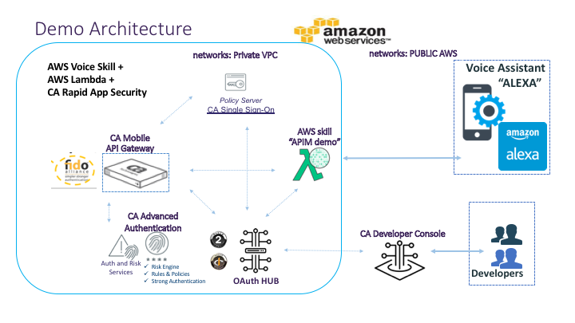

## Speaking Flow
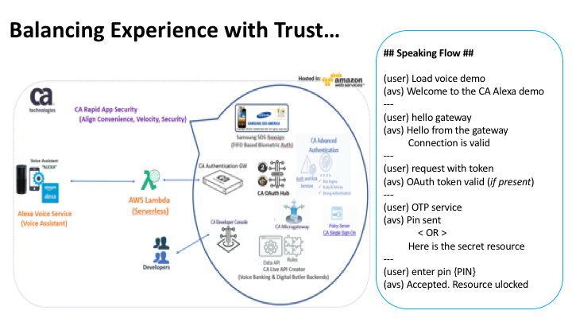

## Getting Started Instructions

### API Gateway Configuration

#### Login to gateway and create API using path= /alexa/*
[IMPORT POLICY](gwPolicy/alexaPolicy.xml)

*API gateway **must** have OAuth+OTP configured along with alexauser configured within Internal IdP*
* Note the policy edits necessary on lines:
    * Line #32: Configure mobile number to recieve SMS
    * Lines #17, #34, #45 & #52 enable OAuth token validations
    * Line #26 & #27 enable authorization of both user (alexauser) and group (alexa)

#### Sample Gateway Policy
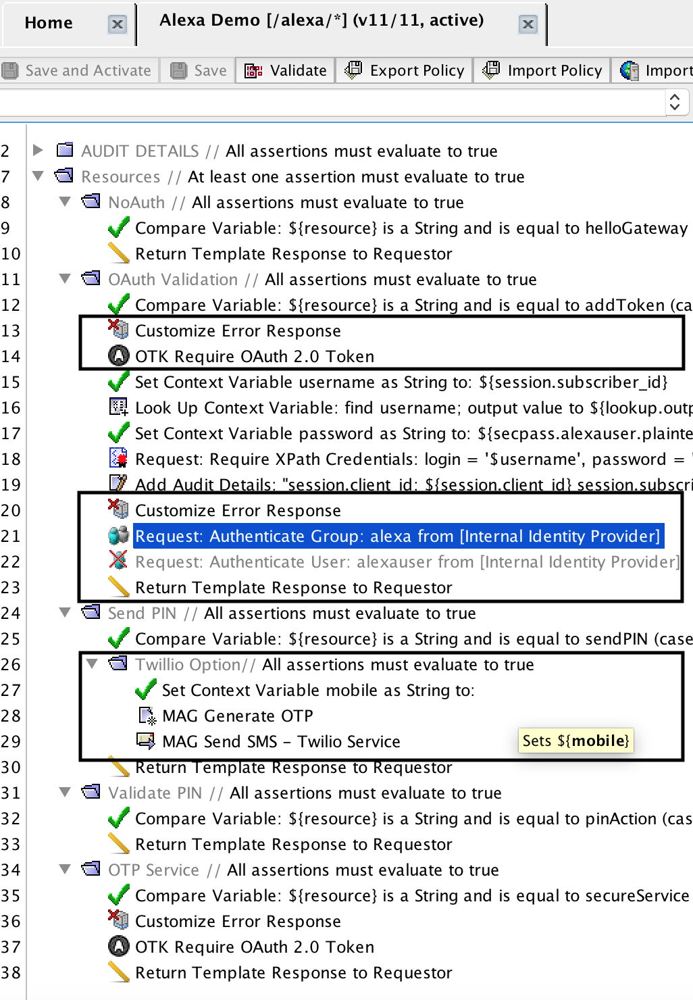

#### Sample Internal Identity Provider
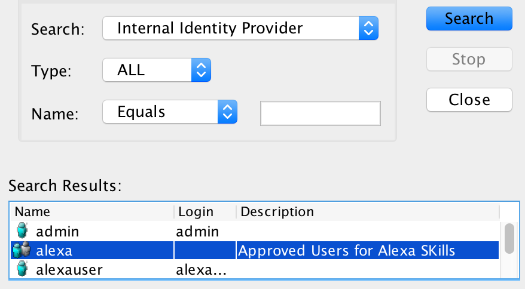

#### Alexa OAuth Client
####  Note: callback is available in console during account linking
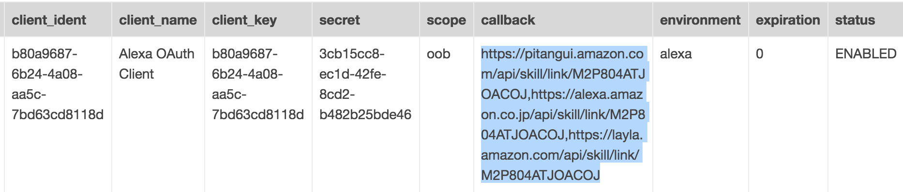

### AWS Lambda Configuration
* Login to AWS consle https://aws.amazon.com/
* Create a role for Lambda execution (i.e., lambda_basic_execution) with CloudWatch Logs enabled
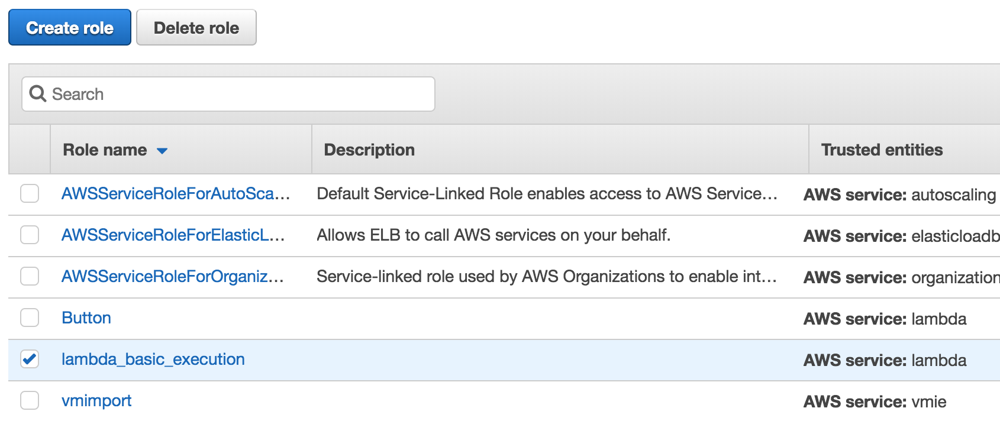

* Create a new custom Lambda function
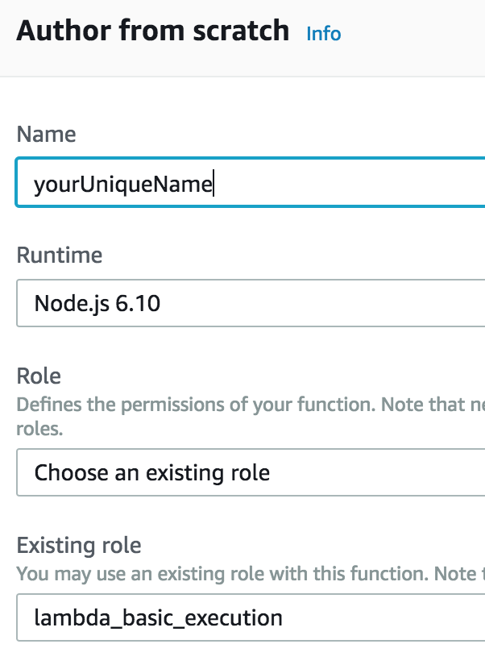

* Import Lambda function through `upload a .ZIP file` button in the FUNCTION CODE
    * [Link to zip file](lambdaExport/alexaAPIM-baa11f01-e010-4e73-8db3-4f71484870c3.zip)
    
* Add the **Alexa Skills Kit** trigger to your new function in the DESIGNER tab
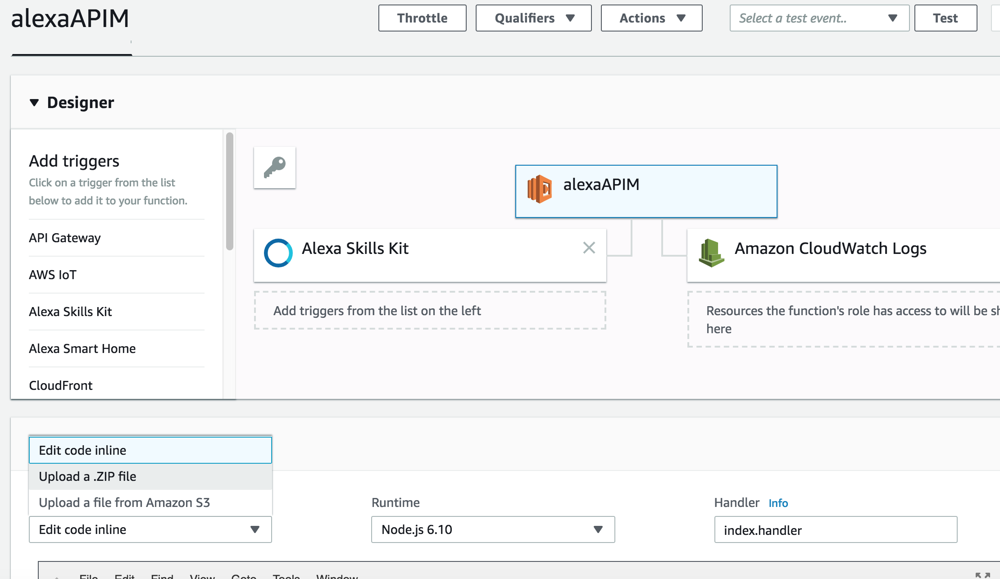

* Add the OAuth/Gateway configuration into MagServer ENVIRONMENT VARIABLES
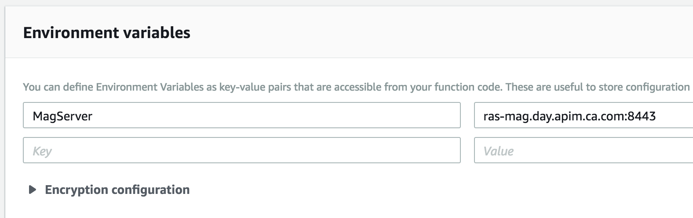

* Add the role created earlier in EXECUTION ROLE
* Increase the timeout setting to >8 sec in Basic Settings tab
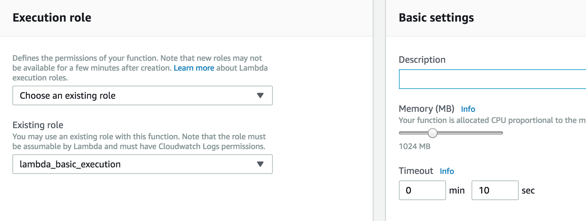

* **SAVE FUNCTION & COPY ARN VALUE**
    * arn:aws:lambda:us-east-0:334429738445:function:alexaDemo

### Alexa Skill Configuration
* Log in to the Alexa Console - https://developer.amazon.com/alexa/console
* Create custom skill using skill builder

#### Invocation Name:
**voice demo**

#### Intent, Utterance and Slot Configuration
Intent | Utterance | Slot | Slot Type
------------ | ------------- | ------------ | -------------
HelloGatewayIntent | hello gateway | none | none
AddTokenIntent | token service | none | none
MFAServiceIntent | OTP service | none | none
PinActionIntent | pin number {PIN} | PIN | AMAZON.FOUR_DIGIT_NUMBER
MyLogoutIntent | log out | none | none

#### Configure ARN endpoint created in Lambda
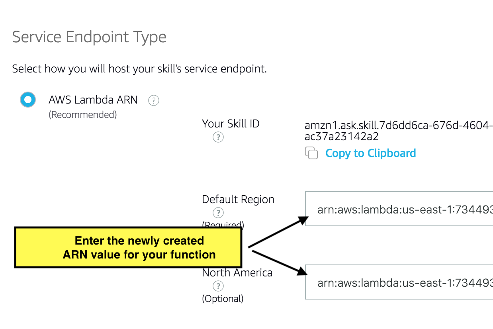

#### Enable OAuth --> ACCOUNT LINKING
* Select ACCOUNT LINKING to configure the OAuth client created
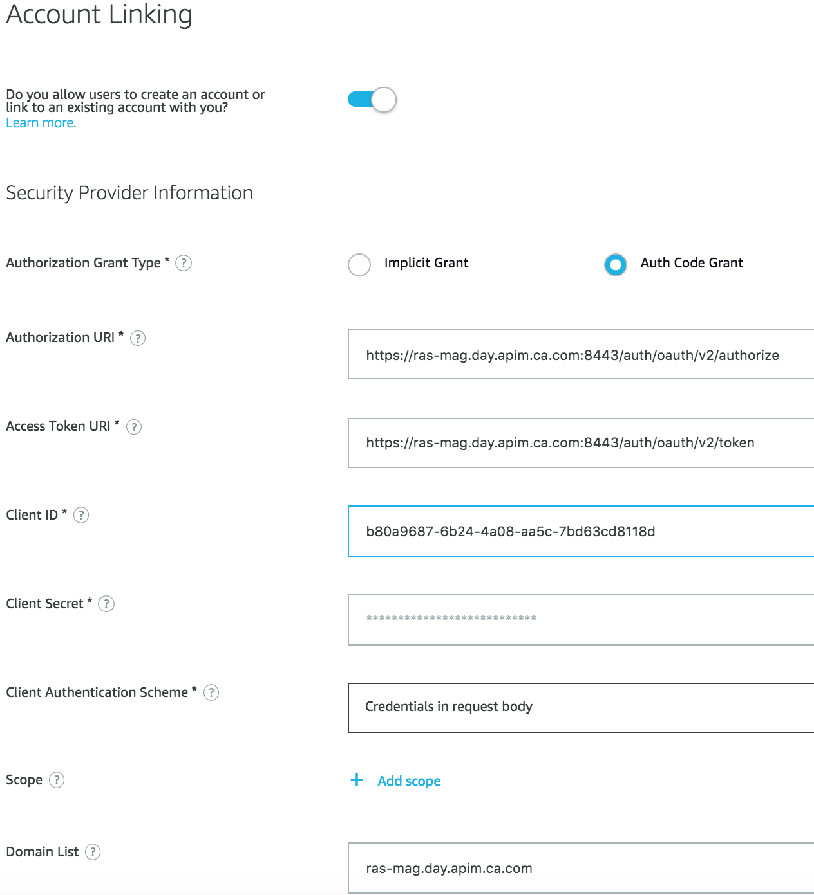

#### LINK ACCOUNT using ALEXA Mobile App to enable OAuth
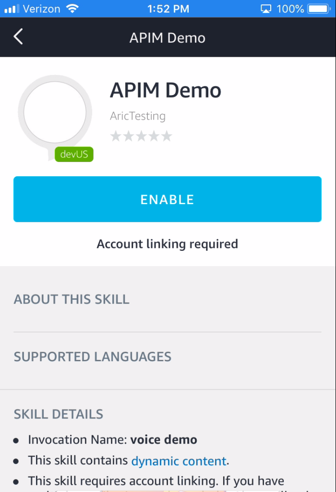

## Test the new skill with the following utterances
* **start voice demo**
    * *loads the AWS Lambda function*
* **hello gateway**
    * *connects to gateway without OAuth*
* **token service**
    * *connects to gateway & requires OAuth*
* **OTP service (unvalidated pin)**
    * *sends OTP challenges user to validate the PIN issued*
* **pin number {PIN}**
    * *submits the OTP recieved via Twilio*
* **OTP service (validated pin)**
    * *checks OAuth and if PIN has been validated, then returns protected resource*
* **log out**
    * *clear session and reset PIN validation*

